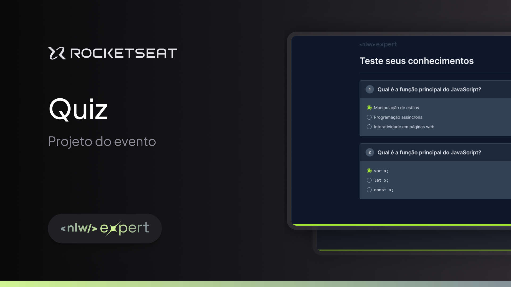

<h1 align="center"> Quiz Expert </h1>

Essa aplicação foi desenvolvida durante o NLW Expert da Rocketseat.  

  

  

 <h3 align="center"><a href="https://isadoraguiar.github.io/quiz-expert" target="_blank">Projeto ao vivo</a></h3>

### 🚀 Tecnologias

Esse projeto foi desenvolvido com as seguintes tecnologias:

- HTML
- CSS
- JavaScript
- Git e Github
- Figma

### :memo: Licença

Esse projeto está sob a licença MIT.

---

Feito com ♥ by Isadora Aguiar :wave:
